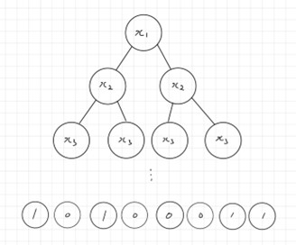
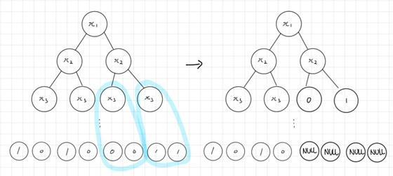
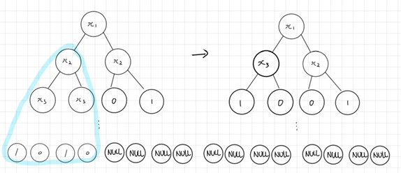

# Tree Simplifcation in C++
Designed a program in C++ which uses tree algorithm.
Implemented tree simplification, which is removing unnecessary nodes in tree data structure based on the Boolean AND function and thus
increases the efficiency of the program by reducing wasted memory.

# Algorithm diagram

